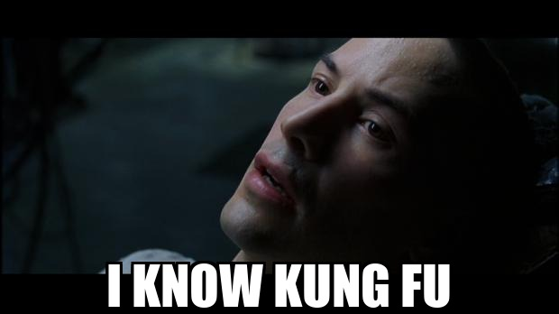

# I know Spring Boot

There's that scene in The Matrix where Neo wakes up from the training chair and just says it: *"I know kung fu."*
Not "I read about kung fu." Not "I watched some videos." He *knows* it. Wired in. Ready.

I'm not Neo. But I've been chasing that feeling in 2026.

## The challenge I made for myself

At the end of 2025 I made a deal with myself: learn at least three new languages in 2026. Not the hello world kind. Not the "I followed a tutorial" kind. The real kind, where you hit something complex, sit with it, and come out the other side actually understanding why it works.

Java was first on the list.

I'd already seen a lot of it. The syntax wasn't alien. The JVM wasn't a mystery. But *knowing about* something and *knowing* something are different things. I wanted to close that gap. So I built this repository as a living notebook. Every problem I face here is a problem I chose to solve, not copy-paste my way through.

## The tools I'm using and the ones that fight back

Maybe you'd expect me to say "I'm using AI to learn faster." That's partly true. I use multiple AI tools to argue with, to clarify my thinking, to challenge assumptions I didn't know I had. But the honest answer is that **AI alone isn't enough**.

The other half is other developers. Real people I provoke with obstacles: "here's what I built, what's wrong with it?" or "why would this break?" That friction is the point. Learning without resistance is just reading.

## The Spring Boot journey begins here

This repository starts with Spring Boot. Not because it's the most exciting thing in the Java ecosystem, but because it's the right place to build muscle memory. REST endpoints, dependency injection, JPA, Docker. These are the foundations that everything else sits on.

The complexity will come. I'm saving it for when the foundations feel solid.

## What going deep actually means to me

I could have generated this project in thirty seconds. The AI tools would have done it happily.

But I didn't. Every file here was written with a question in mind. Why does this annotation exist? What does this config actually do to my data over time? Why does this thing need to start before that other thing? Each small question leads to a real answer, and real answers stick.

Small things compound. Answering them yourself, even when the answer is one message away, is the difference between knowing *about* something and knowing it.

## To wrap up

This is a study repository, not a production system. It's a place where I'm allowed to be wrong, to ask obvious questions, to rebuild something three times because the third version finally makes sense to me.

The 2026 challenge isn't about finishing three languages. It's about the quality of the understanding I carry out the other side.

Neo didn't just load the program. He used it in a fight.

I'm still in the chair, but the upload is going well.
